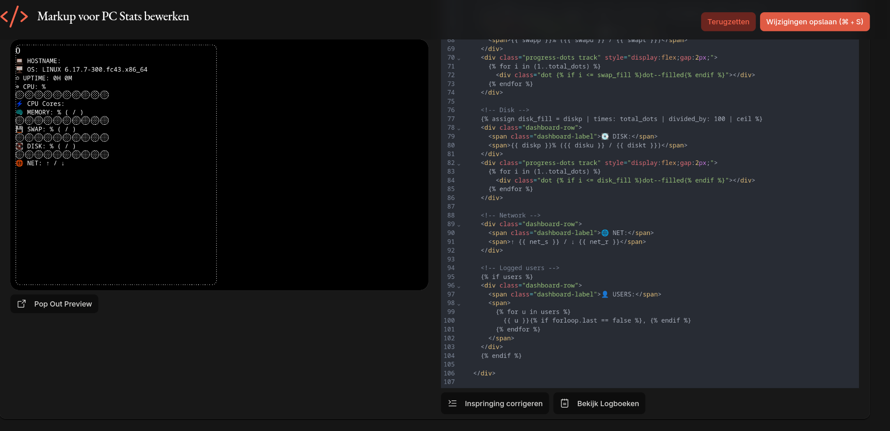
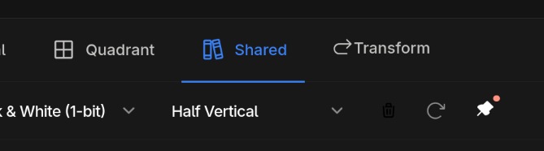
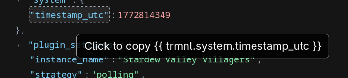
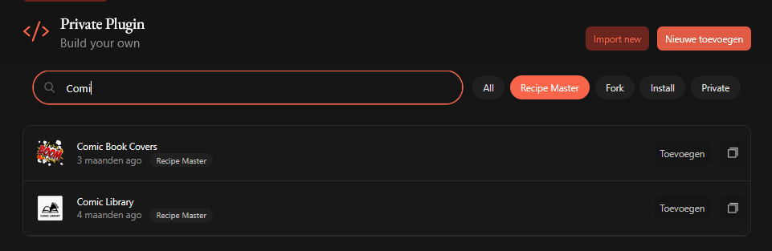
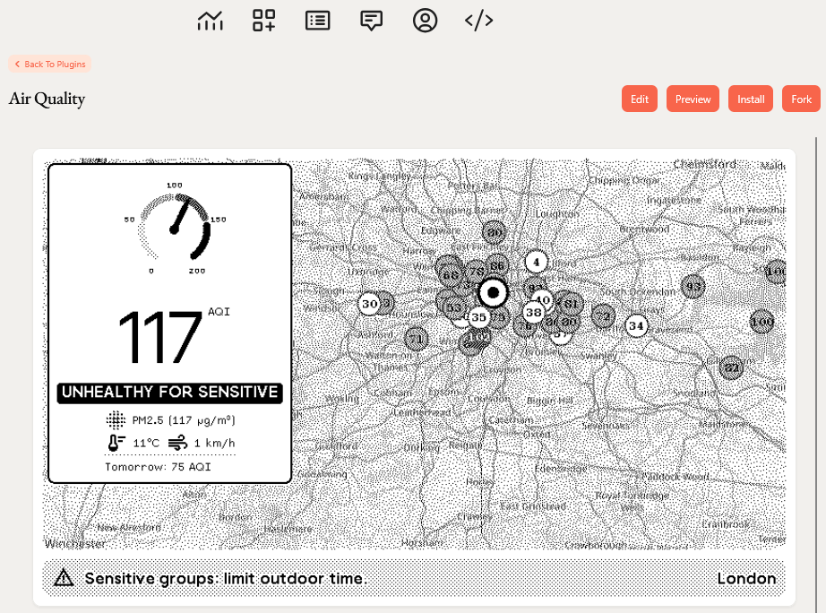
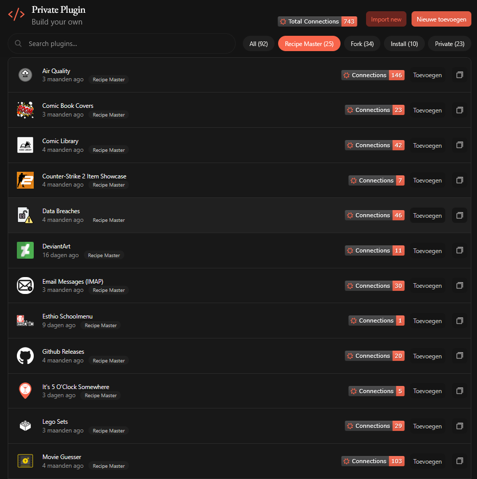

# TRMNL Userscripts

A small collection of users0cripts that enhance the editing experience for the [TRMNL](https://trmnl.com) plugin editor.

These scripts improve usability, simplify navigation, and add helpful tools when working with plugin markup and layouts.

---

## 📌 Sticky Preview

Adds a toggle button to the markup editor toolbar that keeps the **preview panel sticky** while scrolling through a long editor. The preview stays pinned just below the page header, so you can always see the result while editing code at the bottom of the file. State is persisted across page loads.

**Screenshot:**

**Icon:**

**Install:**
https://raw.githubusercontent.com/ExcuseMi/trmnl-userscripts/main/sticky-preview.user.js

---

##   Better variables

Adds **Copy** and **Download** buttons for JSON & YAML to the "Your Variables" on the markup editor.
Uses a nicer viewer with colors, collapsing, copy paths and more.
Show the total size in KB.

**Screenshots:**

**Install:**
https://raw.githubusercontent.com/ExcuseMi/trmnl-userscripts/main/better-variables.user.js

---

## 🚫 No Floating Sidebar

Moves the floating bottom sidebar into the top navigation bar, creating a cleaner and more compact editing interface.

**Install:**
https://raw.githubusercontent.com/ExcuseMi/trmnl-userscripts/main/no-floating-sidebar.user.js

---

## 🎨 Shared View Selector

Adds a dropdown to the **Shared markup editor** that allows quick switching between layout templates:

* Full
* Half Horizontal
* Half Vertical
* Quadrant

The script automatically fetches the corresponding view templates from the plugin archive and injects them into preview requests.

**Install:**
https://raw.githubusercontent.com/ExcuseMi/trmnl-userscripts/main/shared-view-selector.user.js

---
## 📋 Private Plugin Organiser

Adds category filters (All, Recipe Master, Fork, Install, Private) and a search bar to the private plugins page. Remembers your last selection and resets if no plugins match, ensuring you always see relevant content.

**Screenshot:**

**Install:**
https://raw.githubusercontent.com/ExcuseMi/trmnl-userscripts/main/private-plugin-organiser.user.js

## ✏️ Recipe Edit Button

Adds an **Edit** button on recipe pages you own. The button only appears when the logged-in user matches the recipe owner, and links directly to the plugin settings edit page.

**Screenshot:**

**Install:**
https://raw.githubusercontent.com/ExcuseMi/trmnl-userscripts/main/recipe-edit-button.user.js

---

## 🏷️ Recipe Master Badges

Adds install and fork count badges to every **Recipe Master** plugin on the private plugins page. Badges are clickable and link directly to the plugin’s recipe page. Uses the [TRMNL Badges](https://hossain-khan.github.io/trmnl-badges/) service.

**Install:**
https://raw.githubusercontent.com/ExcuseMi/trmnl-userscripts/main/master-recipe-badge.user.js

---

## 👤 User Stats Badges

Displays your personal connection count badge next to the “Private Plugin” title. Also powered by the [TRMNL Badges](https://hossain-khan.github.io/trmnl-badges/) service.

**Install:**
https://raw.githubusercontent.com/ExcuseMi/trmnl-userscripts/main/user-stats-badge.user.js

---

# Installation

1. Install a userscript manager:

   * https://violentmonkey.github.io/
   * https://www.tampermonkey.net/
   * https://www.greasespot.net/

2. Click one of the **Install** links above.

3. Your userscript manager will prompt you to install the script.

4. Scripts will automatically update when new versions are published.

---

# License

MIT License
