# TRMNL Userscripts

A small collection of users0cripts that enhance the editing experience for the [TRMNL](https://trmnl.com) plugin editor.

These scripts improve usability, simplify navigation, and add helpful tools when working with plugin markup and layouts.

---

## 🚫 No Floating Sidebar

Moves the floating bottom sidebar into the top navigation bar and adds several quality-of-life enhancements.

- **Compact top nav** — the floating sidebar is moved into the top nav and compacted, freeing up screen space
- **Private Plugins button** — quick-access nav button linking to the private plugins page, with active-state highlighting
- **Analytics button** — nav button linking to the analytics page; the icon turns **red** when plugins are erroring, **orange** when degraded, and stays grey when healthy (status is fetched once per hour and cached)
- **Markup editor tab counts** — on the markup editor, each layout tab (Full, Half Vertical, Half Horizontal, Quadrant) shows a live usage count pulled from the Analytics "At a Glance" widget, so you can see at a glance how many devices use each layout

**Screenshots:**

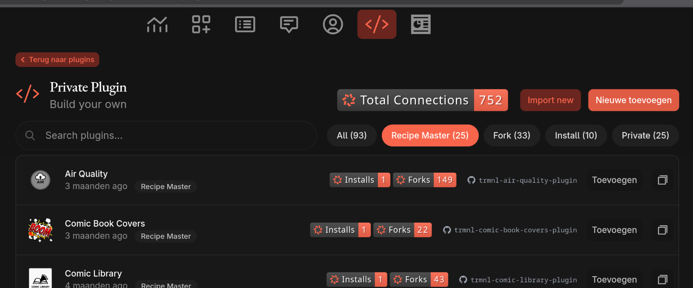

**Install:**
https://raw.githubusercontent.com/ExcuseMi/trmnl-userscripts/main/no-floating-sidebar.user.js

---

## 🐙 GitHub Sync

Push your TRMNL plugin code to a GitHub repository and pull it back on demand — keeping your plugins version-controlled and synced across browsers and devices.

- **Push to GitHub** — uploads all plugin files (`settings.yml`, layout `.liquid` files) to a configured repo and branch
- **Pull from GitHub** — downloads files from GitHub and applies them to the plugin via the TRMNL API
- **Auto-push** — optionally push on every TRMNL save
- **Compare with GitHub** — inline diff between the live TRMNL code and what's in GitHub
- **Recent commits** — shows the last 5 commits for the plugin path, each expandable to show an inline diff
- **Config repo** — a single `.trmnl-sync.json` file in a dedicated GitHub repo stores all plugin configs, keeping settings in sync across browsers automatically
- **Browse repos** — searchable dropdown to pick any of your GitHub repositories
- **Plugin list badges** — GitHub icon + repo name shown next to each configured plugin on the private plugins page
- Supports dark mode, Turbo navigation, and per-plugin branch/path overrides

**Screenshot:**

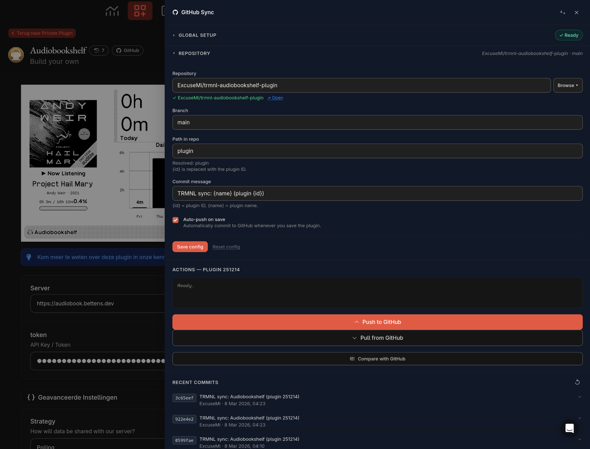
- 
**Install:**
https://raw.githubusercontent.com/ExcuseMi/trmnl-userscripts/main/github-sync.user.js

---

## 📌 Sticky Preview

Adds a toggle button to the markup editor toolbar that keeps the **preview panel sticky** while scrolling through a long editor. The preview stays pinned just below the page header, so you can always see the result while editing code at the bottom of the file. State is persisted across page loads.

**Screenshot:**

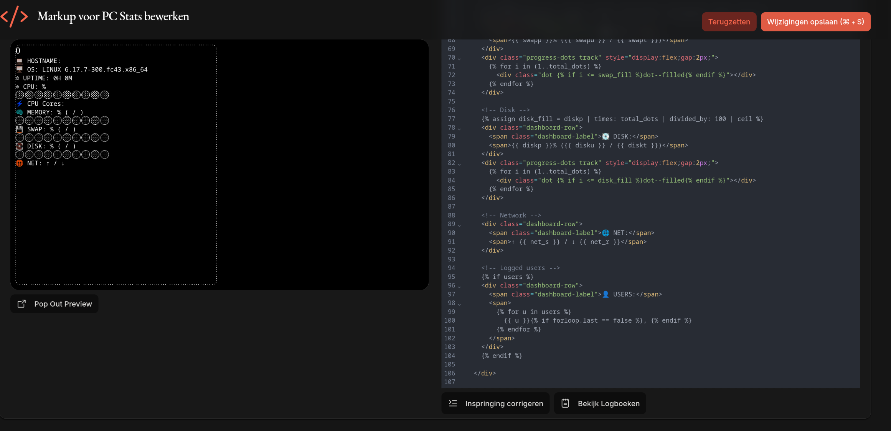

**Icon:**

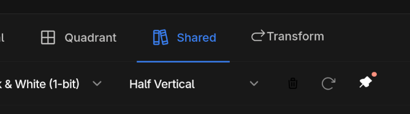

**Install:**
https://raw.githubusercontent.com/ExcuseMi/trmnl-userscripts/main/sticky-preview.user.js

---

##   Better variables

Adds **Copy** and **Download** buttons for JSON & YAML to the "Your Variables" on the markup editor.
Uses a nicer viewer with colors, collapsing, copy paths and more.
Show the total size in KB.

**Screenshots:**

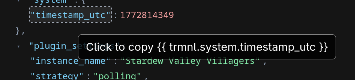

**Install:**
https://raw.githubusercontent.com/ExcuseMi/trmnl-userscripts/main/better-variables.user.js

---

## 🎨 Shared View Selector

Adds a dropdown to the **Shared markup editor** that allows quick switching between layout templates:

* Full
* Half Horizontal
* Half Vertical
* Quadrant

The script automatically fetches the corresponding view templates from the plugin archive and injects them into preview requests.

**Screenshots:**

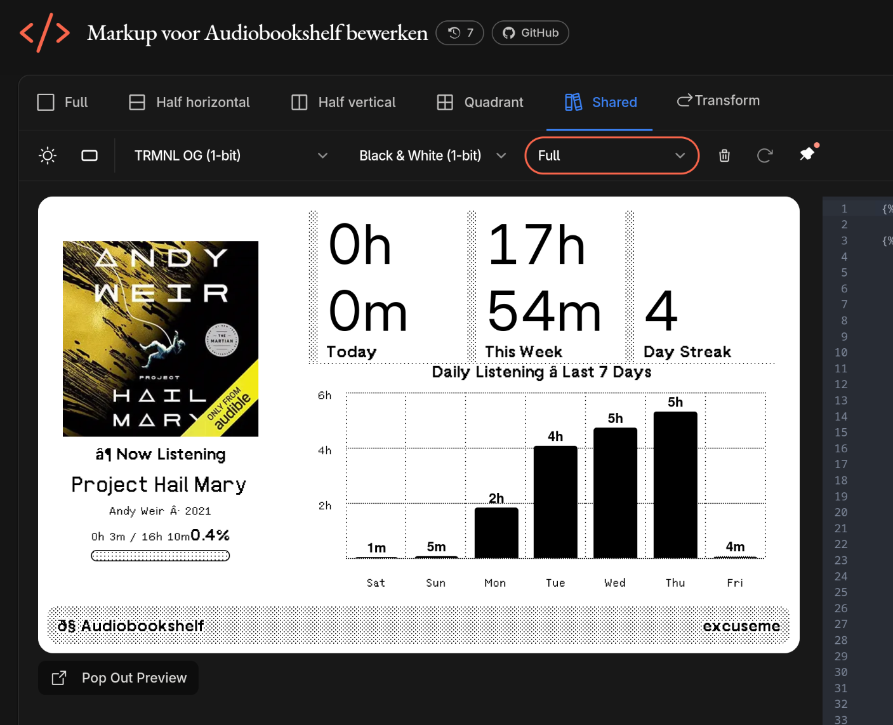

**Install:**
https://raw.githubusercontent.com/ExcuseMi/trmnl-userscripts/main/shared-view-selector.user.js

---

## ▶️ Markup Demo Tab

Adds a **Demo** tab to the markup editor that loads the recipe's demo page in an inline iframe, showing all layout previews (Full, Half Horizontal, Half Vertical, Quadrant) with the full device picker — without leaving the editor.

- **Inline iframe** — demo content appears inside the editor card, below the tab bar, with the rest of the page navigation intact
- **Full viewport width** — the iframe breaks out of the card's column width so wider devices like TRMNL X display without horizontal scrolling
- **Full viewport height** — iframe height is calculated dynamically to fill the remaining screen below the tabs
- **No reload** — switching back and forth between Demo and other tabs does not re-fetch the demo page

**Screenshot:**
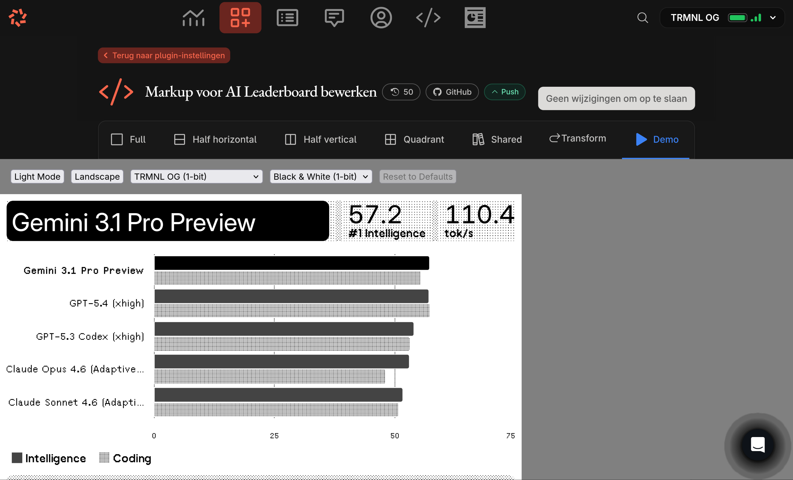

**Install:**
https://raw.githubusercontent.com/ExcuseMi/trmnl-userscripts/main/markup-demo-tab.user.js

---
## 📋 Private Plugin Organiser

Adds category filters (All, Recipe Master, Fork, Install, Private) and a search bar to the private plugins page. Remembers your last selection and resets if no plugins match, ensuring you always see relevant content.

**Screenshot:**

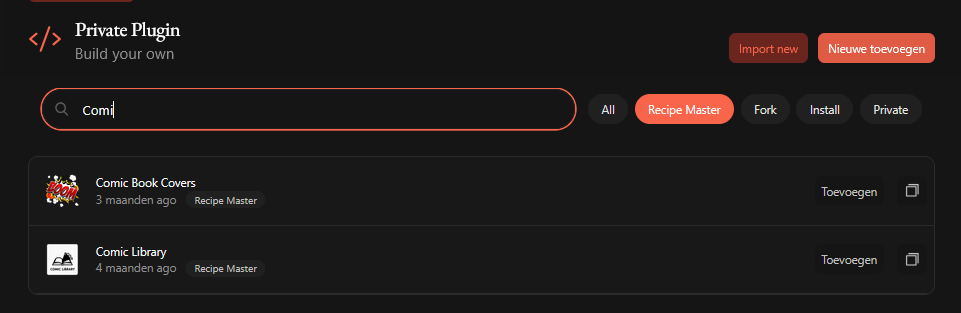

**Install:**
https://raw.githubusercontent.com/ExcuseMi/trmnl-userscripts/main/private-plugin-organiser.user.js

## ✏️ Recipe Edit Button

Adds an **Edit** button on recipe pages you own. The button only appears when the logged-in user matches the recipe owner, and links directly to the plugin settings edit page.

**Screenshot:**

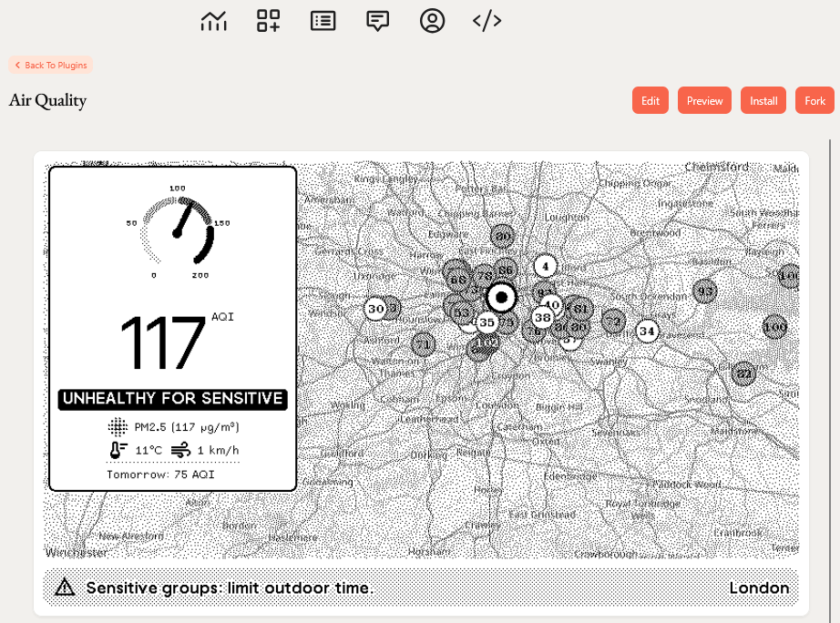

**Install:**
https://raw.githubusercontent.com/ExcuseMi/trmnl-userscripts/main/recipe-edit-button.user.js

---

## 🏷️ Recipe Master Badges

Adds connection count badges to every **Recipe Master** plugin on the private plugins page. Badges are clickable and link directly to the plugin’s recipe page. Uses the [TRMNL Badges](https://hossain-khan.github.io/trmnl-badges/) service.
*These are a bit too much visual clutter for me (as in too many orange highlights on one page), but I'll leave it up to the user.*
**Screenshots:**

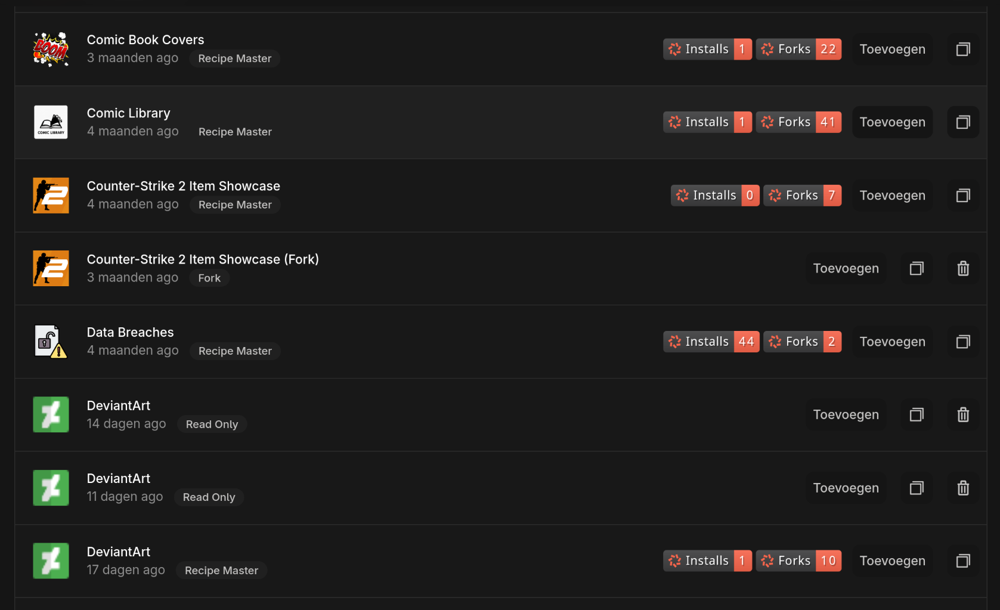

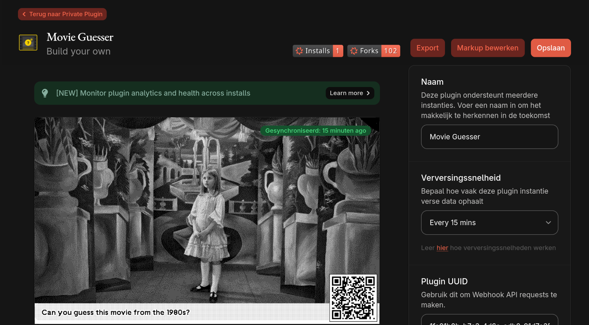

**Install:**
https://raw.githubusercontent.com/ExcuseMi/trmnl-userscripts/main/master-recipe-badge.user.js

---

## 👤 User Stats Badge

Displays your personal connection count badge next to the “Private Plugin” title. Also powered by the [TRMNL Badges](https://hossain-khan.github.io/trmnl-badges/) service.
*These are a bit too much visual clutter for me (as in too many orange highlights on one page), but I'll leave it up to the user.*

**Screenshots:**
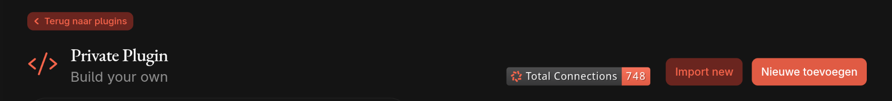

**Install:**
https://raw.githubusercontent.com/ExcuseMi/trmnl-userscripts/main/user-stats-badge.user.js

---

# Installation

1. Install a userscript manager:

   * https://violentmonkey.github.io/
   * https://www.tampermonkey.net/
   * https://www.greasespot.net/

2. Click one of the **Install** links above.

3. Your userscript manager will prompt you to install the script.

4. **Auto-updates:** Tampermonkey updates scripts automatically. Violentmonkey can also check for updates on a schedule — configure it under **Settings → Check for script updates every N day(s)**, or use the **Update All** button in the dashboard.

5. **Tampermonkey on Chrome:** You may need to grant the extension access to your browser activity. If a script doesn't seem to run, go to the Tampermonkey extension settings and enable **"Allow access to file URLs"** or switch the extension access to **"Allow on all sites"** in Chrome's extension settings.

---

# Deprecated scripts

## 💾 Editor Backups
**Deprecated because GitHub Sync is far better and the one I'll be using myself**
Automatically snapshots the full plugin archive **before and after every save**. View per-file diffs between any two snapshots and restore a previous version with one click. A backup count badge appears in the page header on all plugin settings pages.

- Tracks all archive files: `shared`, `full`, `half_horizontal`, `half_vertical`, `quadrant` layouts, `settings.yml`, and `transform.js`
- Per-file diff view with expand/collapse
- Restore "before" or "after" state via the TRMNL API (requires API key)
- Configurable max backup count and age retention
- On the Account page, a **Use in Backup Script** button saves your API key directly to the script

**Screenshot:**

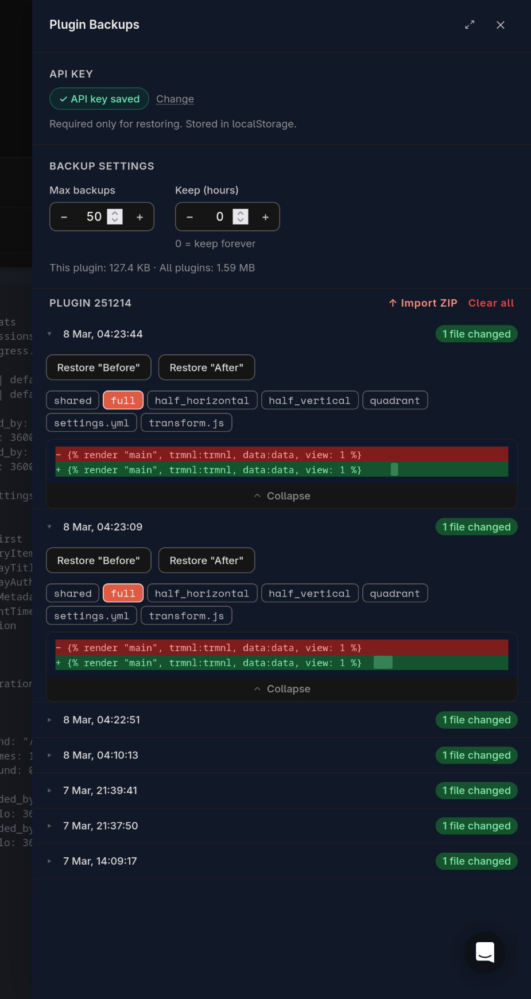

**Install:**
https://raw.githubusercontent.com/ExcuseMi/trmnl-userscripts/main/editor-backups.user.js
---

# License

MIT License
